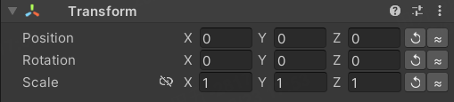
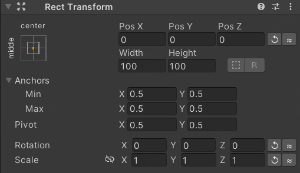
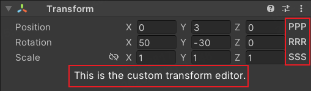
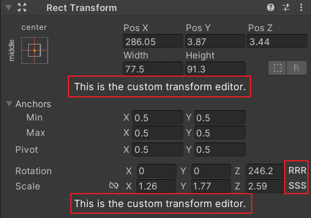

# Transform Enhancer

English | [简体中文](README.zh-CN.md)

**Transform Enhancer** is a Unity Editor plugin that helps you quickly perform Reset and Round operations on objects in the editor.

**Transform Enhancer** is also designed to be easily extensible for additional Transform operations.

## What Can It Do?
### Transform

### RectTransform


## How to Extend?
### Transform
You can inherit from the EnhancedTransformEditor class. We provide several methods that can be overridden.
<br>Example (CustomTransformEditorSample):
```
[CustomEditor(typeof(Transform), true)]
[CanEditMultipleObjects]
public class CustomTransformEditor : EnhancedTransformEditor
{
    public override void OnInspectorGUI()
    {
        base.OnInspectorGUI();

        GUILayout.Label("This is the custom transform editor.", "WhiteLargeCenterLabel");
    }
}
```

### RectTransform
You can inherit from the EnhancedRectTransformEditor class. We provide several methods that can be overridden.
<br>Example (CustomRectTransformEditorSample):
```
[CustomEditor(typeof(RectTransform), true)]
[CanEditMultipleObjects]
public class CustomRectTransformEditorSample : EnhancedRectTransformEditor
{
    public override void OnInspectorGUI()
    {
        base.OnInspectorGUI();

        GUILayout.Label("This is the custom transform editor.", "WhiteLargeCenterLabel");
    }
}
```


## Future Plans
- More extension tools will be developed. Stay tuned! 